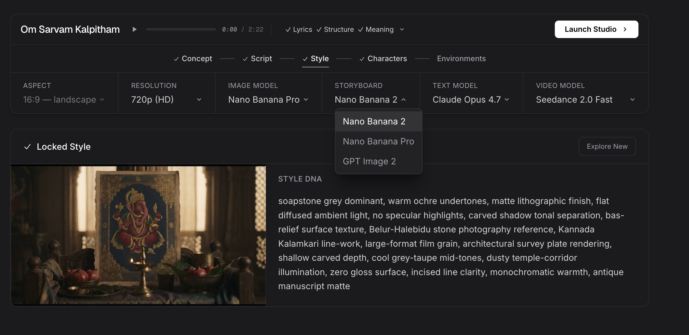
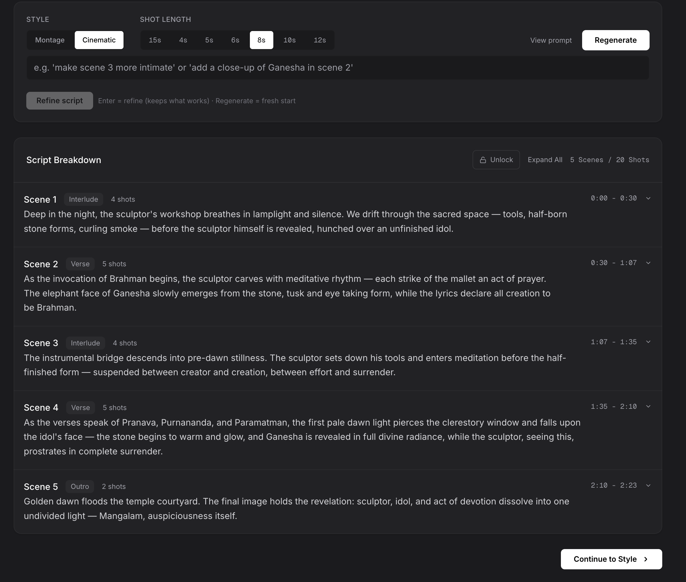
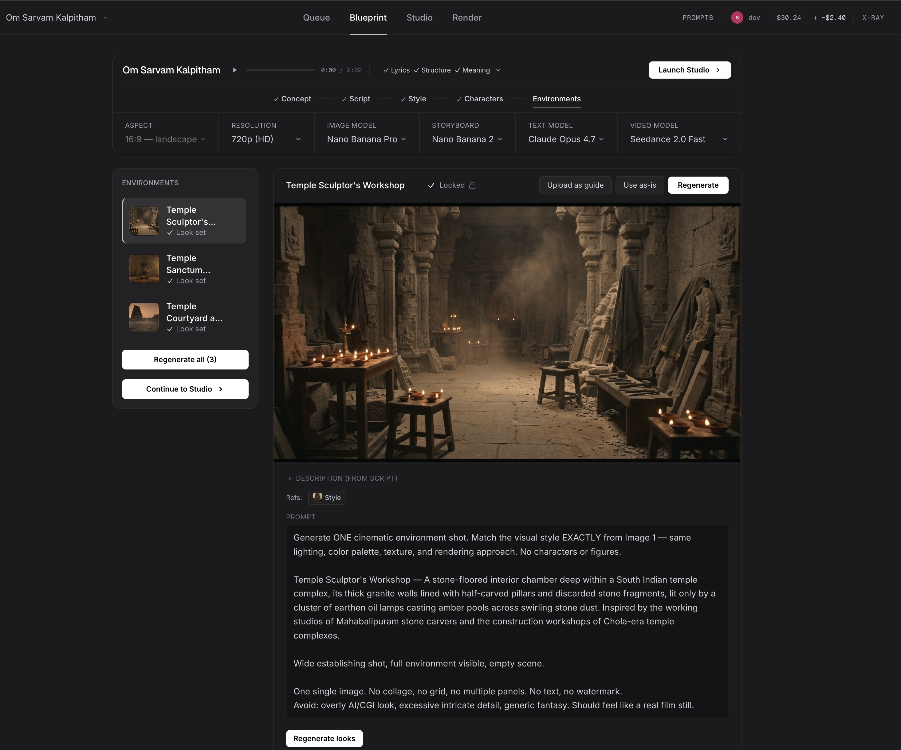
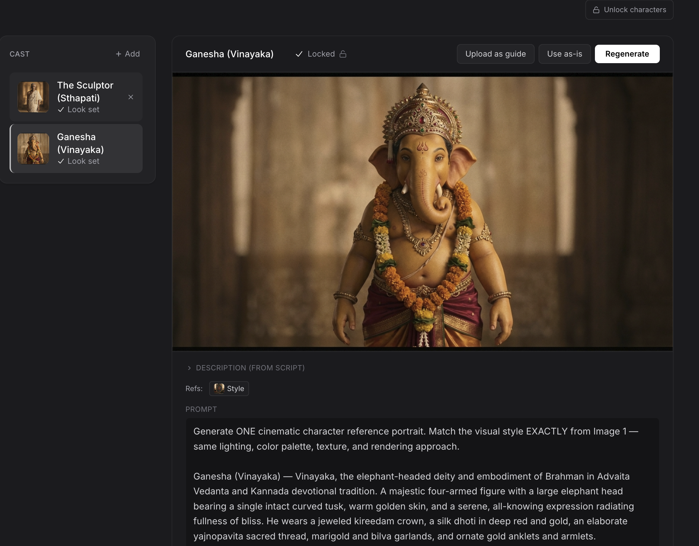
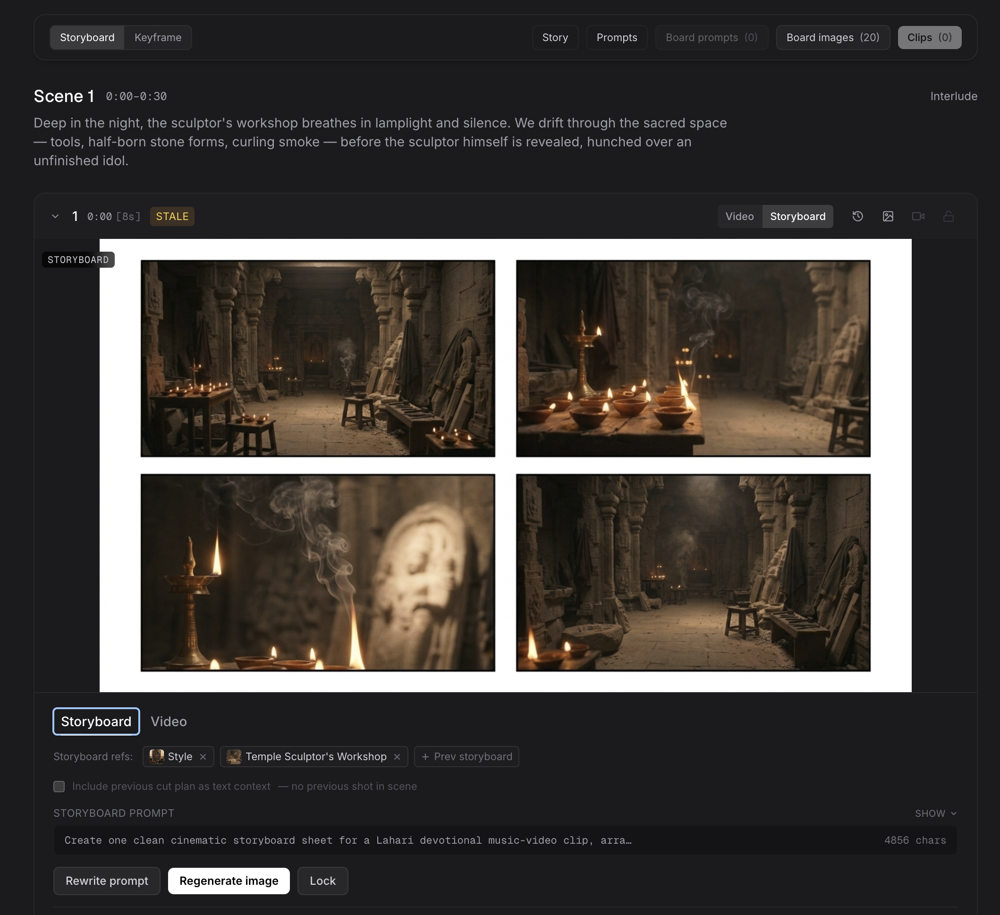
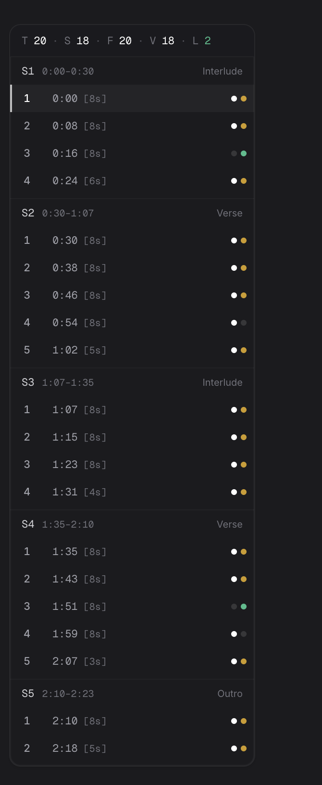
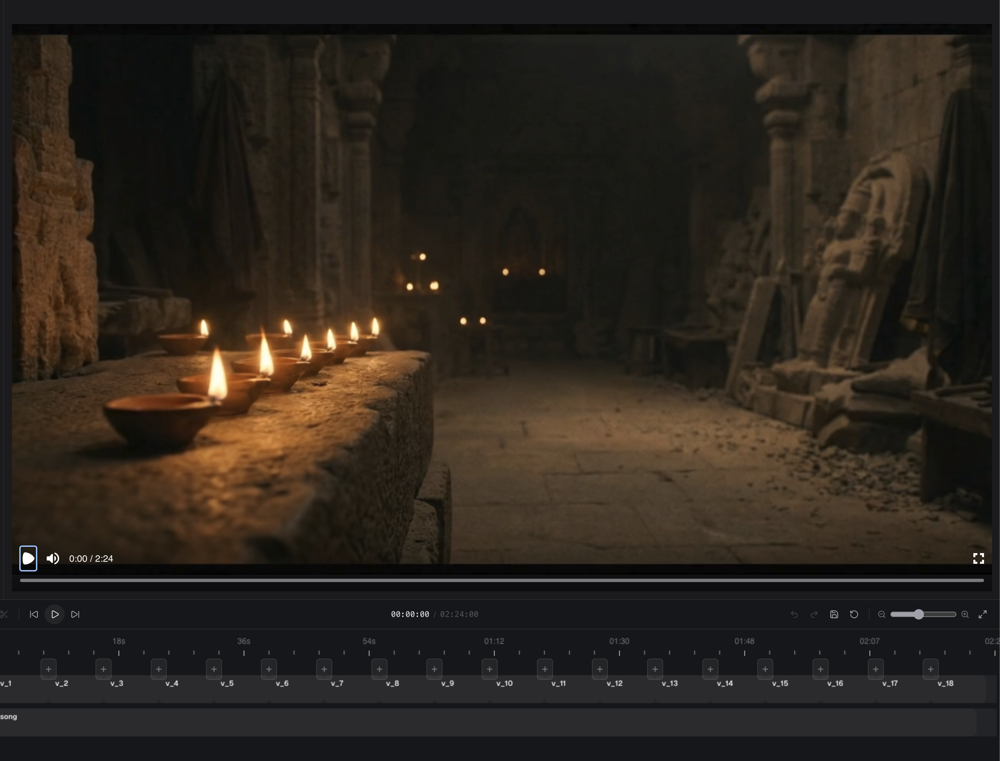

# Lahari AI Video Production Studio

## Case Study

Mothership built Lahari into an AI-assisted video production studio for devotional music videos: a system that turns a song catalog into concepts, scripts, style references, character and environment looks, storyboards, generated clips, editable timelines, and final renders.

The work happened in three connected layers.

First, we built the production machine: a real visual studio with queueing, song analysis, prompt transparency, model selection, reference management, storyboard/video generation, and a render timeline.

Then we made rendering browser-native but cloud-backed, so artists could edit timelines in the web app while long-running FFmpeg/Remotion work happened on Modal render infrastructure.

Finally, we made the whole system agent-native and taste-native: operable through Codex and Claude, backed by proven prompts, workflows, skills, editable notebooks, validation, audit trails, realtime activity, and approval-safe apply flows.

The result is a studio where artists and AI agents coordinate around the same project, see what changed, control models and workflows, manage budget-sensitive generations, preserve creative continuity, and move from song to finished video on a fundamentally different production curve.

The numbers tell that story directly. A polished AI music video used to take **~2 weeks** of fragmented coordination and **$5K–$10K** in production costs. Inside Lahari, the same finished output now lands in **~1 day** for **under $50**, and a single artist can ship **roughly 10 videos per week**. The point is not just faster generation — it's a tighter operating loop where song analysis, creative direction, asset generation, review, edits, and final assembly all share one state.

**Proof points from the build:**

- Full-stack AI video studio across queue, blueprint, shot production, and render.
- Supabase-backed project memory, asset history, prompt catalog, AI call logs, and render state.
- Remote Codex/Claude MCP surface for artist-side operation without forcing a new proprietary agent UI.
- Local project notebooks with editable script and storyboard drafts, config overrides, hashes, journals, and native skill files.
- Browser-native timeline editing backed by Modal cloud render workers, so artists can assemble and render production videos without local GPU/desktop editing infrastructure.
- Realtime agent presence, audit trails, artist-owned memory search, safe apply tools, and render media-library protections.
- Continuous production deployment on Railway with long-running renderer infrastructure and Supabase Storage.

*Project-level controls keep the production loop explicit: aspect ratio, resolution, image model, storyboard provider, text model, video model, locked style, and generation state all live in the same surface.*

## The Problem

AI video tools can generate impressive clips, but production work is bigger than clip generation.

Artists need to choose the right song, understand the lyrics, map the structure, design a concept, maintain character and style continuity, plan scenes and shots, generate references, review variations, assemble the final timeline, and keep track of what has already been approved.

Before Lahari, that work lived across scattered tools, chats, spreadsheets, folders, prompts, and human memory. It was hard to coordinate, hard to reproduce, and slow to scale. Every new generation risked losing context from the previous step.

The goal was not just "make AI videos." The goal was to build a repeatable production system for artists.

## How Mothership Worked

Mothership worked like a forward-deployed product engineering team, not an outside prototype shop.

We stayed close to real artist workflows, shipped against live production friction, and converted repeated manual coordination into product surfaces. When artists hit rough edges — lost context, weak storyboard prompts, stale outputs, timeline edits disappearing after regeneration, difficulty finding older styles, Windows notebook-sync failures — those were treated as product signals, not one-off support tickets.

The work combined product design, AI workflow design, full-stack engineering, prompt systems, database modeling, deployment, and operational debugging. The studio evolved by watching actual projects move through the pipeline and then hardening the parts that slowed production down.

## Phase 1: The Visual Studio

Mothership first built Lahari as a full-stack AI video studio.

The studio starts from Lahari's digitized music catalog. Songs are stored with metadata, audio files, and subtitle/transcription assets in Supabase. From the queue, an artist can start a production project immediately. The system creates a project, downloads audio, reads verified SRT files when available, falls back to Gemini transcription when needed, detects musical structure, summarizes meaning, and caches the analysis back onto the song so future users skip duplicate AI work.

That audio analysis becomes the context chain for the rest of the pipeline.

The Blueprint stage turns the song into a production plan: concept directions, script, scenes, shots, style, character references, and environment references. The system does not treat each model call as isolated. Lyrics, meaning, musical sections, song type, locked concept, style reference, cast, environment, and shot direction flow forward through the pipeline so downstream generations stay grounded.

*The script stage converts a song into scenes, shot counts, durations, pacing controls, and editable production structure.*

*Environment references are generated, reviewed, locked, and reused downstream so shots stay grounded in the same visual world.*

*Character references preserve identity across generated boards, frames, and clips instead of relying on prompt memory alone.*

The Studio stage turns the plan into media. Artists can work shot by shot, choose model/workflow settings, generate frames, generate videos, use storyboard mode for Seedance, inspect histories, refine prompts, lock good outputs, and keep stale work visible instead of silently overwriting it.

*Storyboard mode gives each shot a board, references, prompt text, cut-plan context, generation history, and explicit lock/regenerate controls.*

*The shot map makes project progress visible at a glance: scenes, shot durations, storyboard/video status, and lock state stay inspectable while production moves forward.*

The Render stage gives artists a real timeline editor. Generated clips become editable media. Artists can trim, sequence, assemble, render, publish, and keep version history. Final renders are uploaded to Supabase Storage and written back to the production queue.

*The browser timeline lets artists assemble generated clips into a final video while rendering is delegated to cloud infrastructure.*

In product terms, Phase 1 created four core surfaces:

- **Queue:** choose songs from a production catalog, start work instantly, preserve per-user forks, and reuse cached analysis.
- **Blueprint:** turn audio and meaning into a creative plan: concept, script, style, characters, environments, and reference assets.
- **Studio:** produce shot-level media with visible prompts, references, generation history, storyboard mode, video mode, locks, and stale-state warnings.
- **Render:** assemble generated clips into a final timeline, render asynchronously, track progress, and publish the output.

## Cloud-Native Rendering

Lahari also needed to make rendering feel native without forcing artists into heavy desktop software.

Mothership architected a browser timeline editor on top of Modal-backed rendering. Artists arrange clips, trims, media versions, and audio inside the web app. The app stores the render-authoritative timeline state, then delegates the heavy work to Modal render workers that can run FFmpeg fast paths or Remotion compositions, upload the finished MP4 to Supabase Storage, and report progress back to the studio.

That matters because Lahari isn't just a prompt generator. It's a system artists can run from a laptop anywhere in the world — start multiple projects, generate assets in batches, keep versions in a media library, assemble timelines when ready, and render final outputs without owning GPU or editing hardware. Tooling, compute, and source material are all hosted; everything is one tap away. In practice the render layer sustains **~20 finished videos per day** on dedicated Modal cloud render infrastructure, with no local-machine dependency at any point. The renderer is isolated from the main API and scales independently: Modal keeps the HTTP front door warm, fans out long-running render jobs into dedicated containers, and gives Lahari room to absorb heavier CPU/GPU work as production volume grows.

The render architecture also protects creative work. New generations do not automatically destroy an edited timeline. They arrive as new takes in the media library, and the artist intentionally pulls them into the edit. This turns regeneration from a risky overwrite into normal production iteration.

## Engineering Highlights

Lahari was built as production software, not a thin prompt wrapper.

It includes:

- Supabase Postgres project model for songs, queue items, projects, scenes, shots, cast, environments, assets, AI calls, renders, and final outputs.
- Supabase Storage for audio, references, generated assets, storyboards, clips, and renders.
- Multi-user queue behavior so multiple artists can start their own production forks from the same song.
- Audio analysis pipeline with SRT priority, transcription fallback, timestamp preservation, musical structure detection, song classification, meaning summary, and cached reuse.
- Prompt catalog and pipeline anatomy docs that expose every major prompt, model, variable, and control point.
- Visible/editable prompt fields across the workflow so artists can directly steer generation instead of relying on hidden backend magic.
- Staleness detection when upstream creative choices change, so downstream prompts and media are flagged rather than overwritten.
- Character, environment, and style reference systems that preserve identity and visual continuity across shots.
- Seedance storyboard mode for multi-panel shot planning, cut plans, storyboard boards, and storyboard-driven video generation.
- A render timeline editor with media library, trims, version append, render history, and final publish flow.
- Separate Modal render infrastructure for long-running Remotion/FFmpeg jobs, with progress, watchdogs, fallback, function-call IDs, and Supabase upload.

## Phase 2: Agent-Native Operations

Once the visual studio existed, Mothership turned it into an agent-operable creative workcell.

Codex and Claude can now operate Lahari through a remote MCP surface. Artists connect with a token from `/connect`, open a clean workspace, ask to open a song, and the agent materializes a project notebook locally.

That notebook contains read-only mirrors of canonical project state, editable drafts for scripts and storyboard prompts, project-level config overrides, a local journal, and Lahari-specific skills for script direction, storyboard prompt craft, continuity review, style critique, and render triage.

This changed the operating model. The web app remains the visual studio. Codex or Claude becomes the director/operator sitting beside the artist.

Agents can inspect the project, reason over the song and production state, write or revise scripts and storyboard prompts locally, then persist changes through typed apply tools. Apply tools validate structure, check drift, update Supabase, write events, and return refreshed artifacts. Costly generation and destructive mutations remain explicit approval moments.

The same studio is now operable by artists, agents, or both at once.

The deeper move: agents don't replace the studio, they operate it on the same terms an artist does. Lahari stays canonical in Supabase, the web app stays the visual review surface, and the agent works through a constrained tool surface where state, cost, and rollback discipline hold regardless of who pulled the trigger. The same workflow gets better when either side improves — a better artist sees more in less time, a better agent operates more capably on the same surface.

## Agent-Native Highlights

Phase 2 added:

- Remote MCP with bearer-token auth for Codex and Claude.
- `/connect` onboarding for artists to mint tokens and install the Lahari tool surface.
- Notebook sync via `npx @ssaulgoodman420/lahari-cli`, with MCP file-by-file fallback when shell or npm is blocked.
- Editable `drafts/script.md` and scene-level storyboard markdown files that apply back through validation tools.
- Project-level prompt and model preference overrides.
- Apply-only tools where Codex writes taste-heavy text and Lahari validates/persists it.
- Artist memory search for prior styles, reusable references, older storyboards, and taste patterns.
- Realtime agent-operation presence in the web studio so artists can see when Codex is working.
- Security and audit hardening: rate limits, body limits, redacted logs, ownership checks, and issue capture.
- Render media-library hardening so regenerated clips appear as new takes and never destroy a saved timeline.

The agent-native approach was deliberately not a new chatbot bolted onto Lahari.

Instead of building and billing a separate in-house agent, Mothership brought Lahari to the places artists and technical operators already work: Codex, Claude Code, local workspaces, files, and familiar review loops. Lahari exposes the production system as typed tools, notebooks, drafts, and skills. The agent harness provides the model, memory, editing ability, terminal access, and conversation surface.

That choice matters. Codex and Claude keep improving: better models, better UI, better file editing, better computer use, better long-context behavior. Lahari stays in lockstep with that curve instead of competing with it. The studio becomes agent-compatible infrastructure rather than another isolated AI app.

The local notebook was a key design move. Each project can materialize as a workspace with readable mirrors, editable drafts, config overrides, local journal, and native skills. Agents can use file diffs and surgical edits for scripts and storyboard prompts, while Lahari keeps Supabase as canonical truth. The hybrid MCP + CLI sync path keeps large file bodies out of chat, preserves context across sessions, and gives both artists and agents a tangible production folder.

This lays the foundation for more advanced loops: continual learning from artist decisions, benchmarking prompt changes, comparing generations over time, capturing friction as issues, and improving future projects from prior project memory.

## Taste, Prompts, And Agency

The other major design move was turning Lahari's accumulated production taste into reusable infrastructure.

Mothership did not leave every artist or agent to reinvent the production workflow from scratch. Lahari carries a battle-tested prompt catalog, context recipes, storyboard mode, Seedance cut-plan structure, model routing, render rules, and production-specific skills. The system knows how scripts should pace, how storyboard prompts should be written, how visual references should be reused, how continuity should be checked, and when a generation should be refined versus regenerated.

That taste library lives at multiple levels:

- Engine prompts and workflow recipes provide stable defaults.
- Native skills teach Codex and Claude how to act like a Lahari director, script doctor, storyboard prompt writer, continuity auditor, style critic, and render triage partner.
- Project config lets artists override prompts, model preferences, look-generation instructions, and workflow choices for a specific song or client.
- Draft files let agents and artists edit production text directly before applying it back to the canonical database.

This created a tiered system of agency. The engine holds the proven defaults. The project layer holds artist-specific taste. The agent can edit, propose, override, and apply changes within clear boundaries. Artists can choose how much control to take: use the default workflow, tune a project, rewrite prompts by hand, or ask Codex to reshape the project while Lahari validates and persists the result.

Over time, that makes Lahari more autonomous without making it opaque. The catalog can improve globally, project overrides can preserve local taste, and agents can build on prior decisions instead of starting from zero. Agency comes from giving the model the right editable surfaces, not from handing it an unbounded backend.

## What Made This Hard

AI video production is not one model call. It is state management.

A single song touches lyrics, meaning, structure, concept, script, style, characters, environments, shot prompts, storyboards, generated media, final timeline edits, and publish state. Each upstream decision can make downstream work stale. Each regeneration can produce a better asset while risking damage to an edit that was already in progress.

That meant Lahari needed more than prompt quality. It needed:

- Context chaining so every generation knows what has already been decided.
- Staleness signals instead of silent overwrites.
- Reference management for style, character, and environment continuity.
- Visible prompt and AI-call history so artists can inspect what happened.
- Typed apply tools so agents can change production state safely.
- Explicit approval boundaries for paid or destructive operations.
- Render timeline protection so generation feeds the media library, while editing pulls from the library intentionally.
- Artist-owned memory search so prior styles and assets remain reusable without exposing raw database access.

## What Changed

Before, producing a polished AI music video required coordinating many fragile steps manually: gather assets, understand the song, write prompts, generate candidates, track references, manage revisions, assemble clips, and remember which decisions mattered.

With Lahari, those steps became a production system.

An artist can move through a guided workflow, but still keep control. The system knows the project state, the model choices, the references, the prompt history, the render state, and the next useful action. Agents can assist without becoming a black box because every mutation flows through typed tools, visible drafts, logs, and approval boundaries.

Concretely: production cycles compressed from ~2 weeks to ~1 day. Per-video budgets compressed from $5K–$10K to under $50. Per-artist throughput moved from one video every few weeks to roughly 10 per week. With better traceability and fewer lost decisions along the way.

## Impact

Lahari gives teams a repeatable way to produce AI video at scale. The shift is measurable on four axes:

- **Time:** ~2 weeks → ~1 day per finished video.
- **Cost:** $5K–$10K → under $50 per finished video.
- **Artist throughput:** one artist now ships roughly 10 videos per week.
- **Render capacity:** ~20 finished videos per day on dedicated Modal cloud render infrastructure, with zero reliance on local hardware.

That's not a faster prompt box. It's a different economics curve. Production output grows by adding artists, not by adding budget — and the whole stack is portable, so an artist can run a full production day from a laptop anywhere in the world.

In practical terms, it lets artists:

- Start from a real song catalog instead of an empty prompt box.
- Reuse accurate song analysis across projects.
- Preserve cultural, lyrical, and musical context across the whole pipeline.
- Choose models and workflows per project or per shot.
- Keep style, character, and environment continuity anchored by locked references.
- Review and lock outputs intentionally.
- Track stale work, failed generations, and render status.
- Coordinate with agents without losing authorship or control.
- Move from ideation to rendered video inside one production environment.

The deeper impact is operational. Lahari turns AI video from a series of experiments into a supervised production line.

It also gives teams parallelism. Multiple projects can be in flight, agents can prepare scripts or storyboard prompts while artists review visuals, media can be generated in batches, and final renders can be launched when the timeline is ready. The production bottleneck moves away from "who has the right local machine and editing setup" and toward creative judgment.

## Positioning Line

Mothership built Lahari as a production operating system for AI video: a visual studio, cloud-native render pipeline, and agent-native taste layer that let artists and AI collaborators run the same creative workflow together.

## Short Copy Options

**One-liner**

Mothership built Lahari, an AI video production studio that took music-video production from ~2 weeks at $5K–$10K to ~1 day at under $50 — with artists and AI agents operating the same workflow.

**Website short**

Lahari is an AI-assisted video studio for music-video production. It analyzes songs, builds concepts and scripts, generates references, plans shots, creates storyboard/video assets, assembles timelines, and lets artists coordinate with AI agents through traceable, approval-safe workflows.

**LinkedIn short**

Most AI video demos stop at a clip. Lahari is what happens when you build the whole production machine around the clip: catalog intake, transcription, song analysis, concepts, scripts, style refs, character/env continuity, storyboards, generated videos, render timelines, approvals, budgets, and agent-operated workflows.

## Video Story Angles

**Product demo angle**

Start with a song in the queue. Show Lahari analyzing lyrics and structure, generating a concept, building a script, locking style/cast/environment references, creating storyboard boards, generating videos, assembling the render timeline, and publishing the final output.

**Engineering angle**

Show the hidden machinery: Supabase project state, prompt catalog, context chaining, staleness flags, AI call logs, storyboard cut plans, Modal render worker, FFmpeg/Remotion path, cloud render progress, and final Supabase Storage output.

**Agent-native angle**

Show an artist asking Codex to open a project. Codex syncs the notebook, edits a script or storyboard draft, applies it through Lahari tools, and the web studio updates with realtime agent activity.

**Business impact angle**

Frame it as production compression: weeks of fragmented creative coordination becoming a guided, inspectable workflow where artists and agents can move fast without losing control.

## Video Treatment

The case-study video should feel forward, fast, and crisp. Not a client testimonial, not an agency hype reel. The tone is: here is the work, here is the machine, here is what changed.

**Opening: production is messy**

Start with motion graphics and quick text fragments showing the chaos of AI video production: lyrics, prompts, references, clips, timelines, approvals, model choices, retries, folders, and chat threads. The point is not "AI clips are hard." The point is that production is stateful.

Possible line:

> AI video is not hard because one clip is hard. It is hard because production has memory.

**Context: Lahari needed a production system**

Keep Lahari's setup short and factual. Lahari had a large devotional music catalog, an active production need, and the ambition to produce videos at scale. Mothership built the operating system around that workflow.

Avoid making this sound like "they came to us and we saved them." Lahari is the proof surface, not the pitch.

**Bird's-eye system map**

Show the whole machine once before going deep:

Song catalog -> audio analysis -> concept/script/style/cast/env -> storyboard/video -> render timeline -> final video -> agent workspace.

This gives the viewer a mental model before the UI footage starts.

**Visual Studio walkthrough**

Move through the app in production order: Queue, Blueprint, script, style, characters, environments, storyboard mode, model controls, prompt visibility, shot status, media history. Narration should be concrete:

> Every step writes back to the same project state. Prompts are visible. References are locked. Stale work is flagged. Artists can steer without losing continuity.

**Render machine hero beat**

Show the render timeline as the "machine room." Then zoom into the embedded player and let the rendered video play for a few seconds. This should be the moment where the viewer feels the product becoming real, not just UI.

After that, cut into a short montage of the best generated clips across projects. The montage proves output quality faster than any claim can.

**Agent-native layer**

Once the viewer understands the studio, reveal the agent layer:

> Then we exposed the same production system to Codex and Claude.

Show an artist/operator asking Codex to open a project, the local notebook/drafts, a script or storyboard edit, an apply tool result, and the web studio updating. The important line:

> We did not build a separate chatbot. We brought Lahari to the tools artists and operators already use.

**Close**

End on the pattern:

> Lahari went from fragmented AI-video experiments to a production operating system: visual, traceable, cloud-rendered, and agent-operable.

Then close with Mothership.

## Snapshot Checklist

For the case study and future video, capture the product in the same order the work flows.

**1. Queue**

- Dashboard with Lahari songs, status/action pills, and search/filter context.
- A song row before starting production.
- If available, a row showing multiple user/project states or completed/in-progress work.

**2. Blueprint**

- Audio/analysis view showing lyrics, structure, meaning, or analysis progress.
- Concept phase with generated/locked concept.
- Script phase with scenes/shots visible.
- Style phase with locked preset/reference.
- Character and environment references after generation/selection.

**3. Studio**

- Shot card with storyboard/keyframe mode visible.
- Storyboard prompt/cut plan area.
- Generated storyboard board.
- Video tab or generated clip with version/history controls.
- Any lock/stale/error indicators that show production state.

**4. Render**

- Timeline editor with generated clips arranged.
- Media library drawer with shot versions/takes.
- Render progress/status.
- Final rendered output or render history.

**5. Agent-Native Layer**

- `/connect` or token/install surface if it is visually clean.
- Codex/Claude resolving or opening a Lahari project.
- Notebook workspace showing `mirrors/`, `drafts/`, `config/`, and `journal.md`.
- Codex editing a script or storyboard draft.
- Apply tool result showing validation/persistence/change summary.
- Web studio with realtime "Codex is working" presence.
- A before/after where the agent-generated change appears back in the studio.

## Visual Assets To Pull

- Queue dashboard with song list and action states.
- Audio analysis / Blueprint view showing lyrics, structure, meaning, and concept/script stages.
- Style preset or locked style reference.
- Character and environment reference selection.
- Studio shot card with storyboard/keyframe controls.
- Storyboard board and cut plan.
- Video generation/version history.
- Render timeline with media library.
- Render status/progress and final output.
- Codex/Claude notebook workspace showing mirrors, drafts, config, and journal.
- Web studio realtime "Codex is working" presence.

## Core Takeaway

Lahari proves the Mothership pattern: build the operating system around a client's real workflow, then make it agent-operable.

The win isn't better prompts or faster generation. It's a coordinated machine where software, artists, models, media, approvals, and agents share the same production state — and improvements at any layer compound for every other layer.

The pattern is portable. Don't force teams into a new AI silo or build them another isolated chatbot. Build the operating system around the work they already do, expose it through durable tools and state, and let the best available agents operate it from the environments where people already work.
